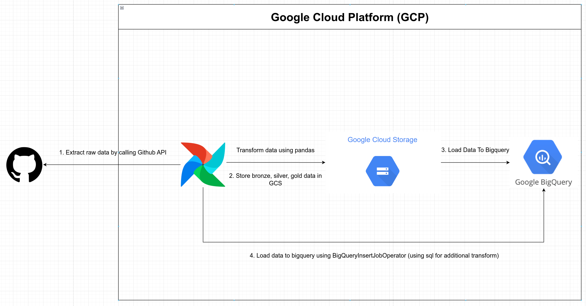
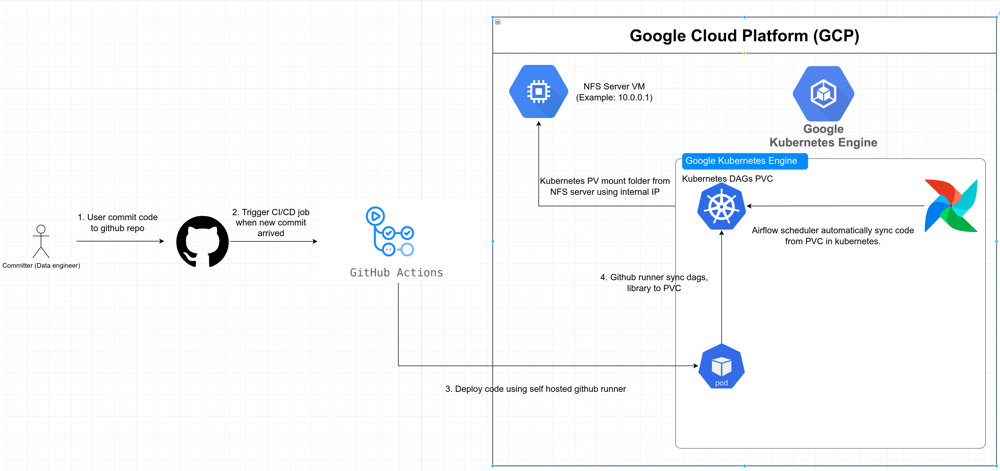
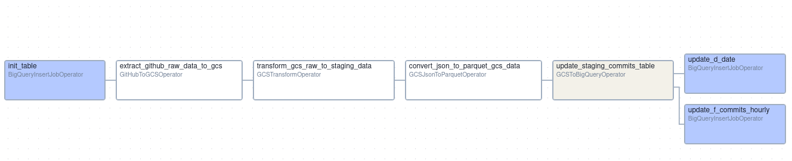
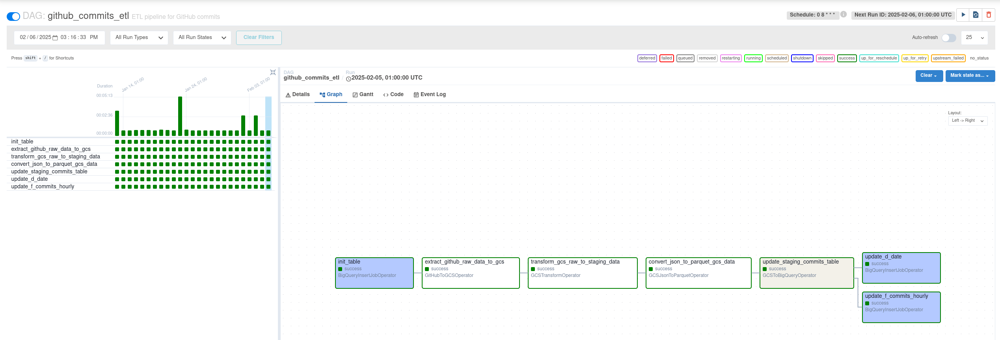
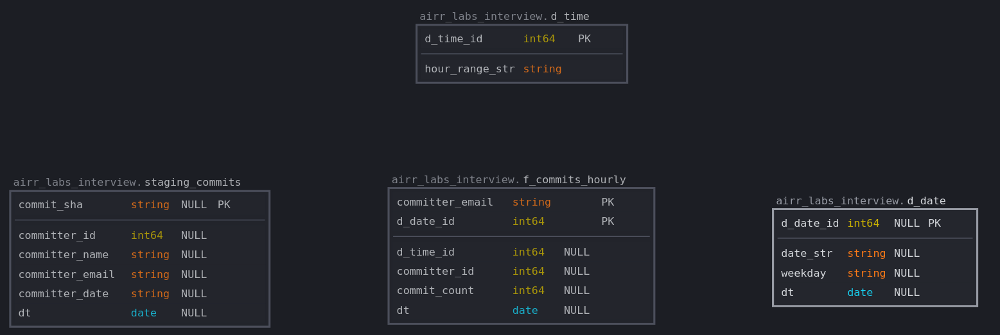
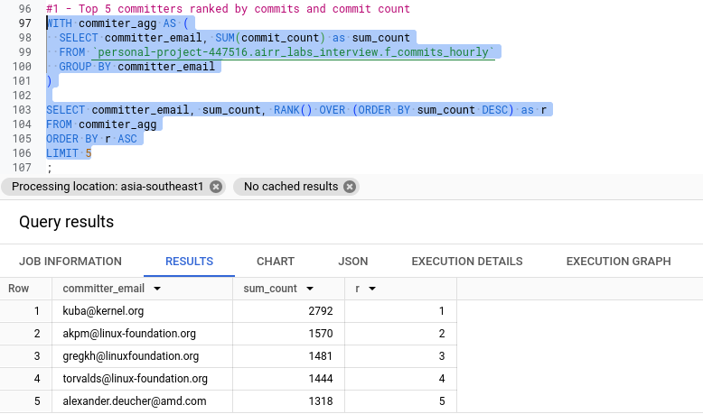
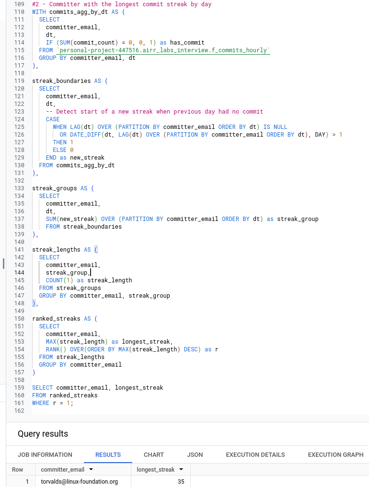
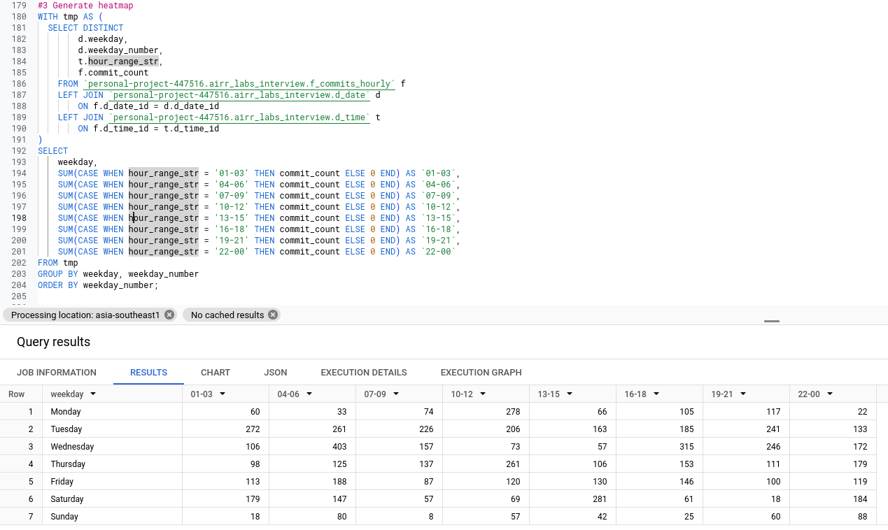

# GitHub API ETLT Pipeline

## Table of Contents
- [Overview](#overview)
- [Changelog](#changelog)
- [Infrastructure](#infrastructure)
- [Architecture](#architecture)
  - [Medallion Architecture](#medallion-architecture)
  - [Pipeline Architecture](#pipeline-architecture)
  - [Deployment Architecture](#deployment-architecture)
  - [Pipeline Components](#pipeline-components)
  - [Pipeline Design](#pipeline-design)
    - [Data Partitioning](#data-partitioning)
    - [Idempotency](#idempotency)
    - [Operation and Maintainability](#operation-and-maintainability)
- [Data Model](#data-model)
  - [Staging Layer](#-staging-layer)
  - [Dimension Tables](#-dimension-tables)
  - [Fact Table](#-fact-table)
  - [Key Features](#key-features)
- [Schedule](#schedule)
- [Setup](#setup)
- [CI/CD](#cicd)
- [Project Structure](#project-structure)
- [Data Analysis Results](#data-analysis-results)
  - [Top 5 Committers by Commit Count](#query-1-top-5-committers-by-commit-count)
  - [Committer with Longest Commit Streak](#query-2-committer-with-longest-commit-streak)
  - [Commit Activity Heatmap](#query-3-commit-activity-heatmap)
- [Development](#development)

## Overview
<details open>
<summary>Click to expand</summary>

An Apache Airflow pipeline that implements ETLT (Extract, Transform, Load, Transform), a variant of the traditional ETL pattern that adds a second transform phase after loading. This pipeline extracts commit data from the Apache Airflow GitHub repository and loads it into BigQuery using a medallion architecture.
</details>

## Changelog
<details open>
<summary>Click to expand</summary>

### February 2025
```
- Migrate Airflow deployment from Cloud Composer to GKE (reduce cost 7x times).
- Add Terraform configurations for automated provisioning kubernetes resources in GCP.

- Use sealed secret for store secret securely in git repo.
```
</details>

## Infrastructure
<details open>
<summary>Click to expand</summary>

The infrastructure code for this project can be found at: https://github.com/nhudinh2103/airflow-infrastructure

This repository contains Terraform configurations for automated provisioning of infrastructure in Google Cloud Platform (GCP), including:
- Google Kubernetes Engine (GKE) cluster setup
- Apache Airflow deployment on GKE
- GitHub Actions self-hosted runners
- SealedSecret for secure secret management
- Network configurations and security settings
- And more infrastructure components

All infrastructure is managed as code using Terraform, enabling automated provisioning and consistent deployments across environments.
</details>

## Architecture

### Medallion Architecture
<details open>
<summary>Click to expand</summary>

The project organizes data into different layers of refinement, with all layers partitioned by day using hive format (dt=YYYY-MM-DD):

- **Bronze Layer**: Raw data from GitHub API stored as JSON files in GCS
- **Silver Layer**: Transformed data stored as JSON files in GCS
- **Gold Layer**: Final data stored as Parquet files in GCS before loading to BigQuery
</details>

### Pipeline Architecture
<details open>
<summary>Click to expand</summary>



The pipeline follows the ETLT (Extract, Transform, Load, Transform) pattern within Google Cloud Platform (GCP):

1. **Extract**: Raw data from GitHub API to Bronze layer
2. **Transform**: 
   - Normalize data and store in Silver layer
   - Convert to Parquet format in Gold layer
3. **Load**: Load Parquet data to BigQuery staging tables
4. **Transform**: Additional transformations using BigQueryInsertJob to create:
   - Dimension tables (e.g., date dimension)
   - Fact tables (e.g., hourly commits)
</details>

### Deployment Architecture
<details open>
<summary>Click to expand</summary>



The deployment process follows a CI/CD approach:
1. Data engineer commits code to GitHub repository
2. GitHub Actions triggers CI/CD job on new commits
3. On successful tests, code is deployed to GCS bucket
4. Cloud Composer (Airflow) automatically syncs code from GCS bucket
</details>

### Pipeline Components
<details open>
<summary>Click to expand</summary>



#### Airflow DAG


Tasks are organized to process data daily, with each execution handling its specific partition (dt=YYYY-MM-DD).

Tasks can run independently, with ability to run parallel for backfill when needed.

The Airflow DAG implements the ETLT pattern through these tasks:

1. **Extract**:
   - `init_table`: Initialize required tables
   - `extract_github_raw_data_to_gcs`: Extract data from GitHub API to Bronze layer

2. **First Transform**:
   - `transform_gcs_raw_to_staging_data`: Transform raw data to Silver layer
   - `convert_json_to_parquet_gcs_data`: Convert to Parquet format in Gold layer

3. **Load**:
   - `update_staging_commits_table`: Load data to BigQuery staging tables

4. **Second Transform**:
   - `update_d_date`: Create/update date dimension
   - `update_f_commits_hourly`: Create/update hourly commits fact table
</details>

### Pipeline Design
<details open>
<summary>Click to expand</summary>

The pipeline is designed with the following key principles:

#### Data Partitioning
- All data layers (Bronze, Silver, Gold) use hive-style partitioning by date (dt=YYYY-MM-DD)
- Each task operates on a daily partition basis
- This partitioning strategy enables:
  - Parallel processing of different date ranges
  - Easy reprocessing of specific time periods
  - Efficient data organization and retrieval
  - Consistent partition format across all layers

#### Idempotency
- All tasks are designed to be idempotent, guaranteeing consistent results across multiple runs
- Each rerun of a task for a specific partition will produce the same output
- This is achieved through:
  - Partition-based data overwriting: Each run completely replaces the data for its partition
  - Isolated partition processing: Operations on one day's data do not affect other days
  - Deterministic transformations: Same input always produces the same output

#### Operation and Maintainability
- **Data Backfilling Capabilities**
  + Pros:
    - Can rerun data independently by day if errors occur
    - Enables selective historical data reprocessing
  + Cons:
    - Can consume significant resources and time when running data for extended periods (1 year or more)
    - Requires careful resource planning for large-scale backfills
    - May impact current production workloads during extensive backfill operations
</details>

## Data Model
<details open>
<summary>Click to expand</summary>

The project implements a star schema design optimized for analyzing GitHub commit patterns:



### 🔄 Staging Layer
`staging_commits`
- Serves as the intermediate storage for transformed GitHub commit data
- Partitioned by date (dt=YYYY-MM-DD) for efficient data loading and historical analysis
- Key fields:
  - `commit_sha`: Unique identifier for each commit
  - `committer_id`, `committer_name`, `committer_email`: Committer details
  - `committer_date`: Raw string timestamp UTC (based on GitHub API response)
  - `dt`: Partition date (converted to GMT+7 for Vietnamese timezone)

### 📊 Dimension Tables

#### Time Dimension (`d_time`)
- Breaks down 24-hour periods into 3-hour ranges
- Enables time-based aggregation and analysis
- Fields:
  - `d_time_id`: Hour identifier (0-23)
  - `hour_range_str`: Human-readable time range (e.g., "01-03", "04-06")

#### Date Dimension (`d_date`)
- Stores calendar attributes for temporal analysis
- Fields:
  - `d_date_id`: Unique date identifier
  - `date_str`: String representation of date
  - `weekday`: Day of the week
  - `dt`: Date value

### 📈 Fact Table

`f_commits_hourly`
- Central table for commit activity analysis
- Granularity: Hourly commits per committer
- Uses `committer_email` as a reliable identifier
  > **Why email instead of ID?** GitHub API may return null values for `committer_id` in repository commits. Email addresses provide a more reliable way to track commit activity.
- Key metrics:
  - All date and time related columns are in GMT+7 timezone (for Vietnamese users)
  - `commit_count`: Number of commits in the time period
  - Partitioned by date (dt=YYYY-MM-DD) for optimal query performance

### Key Features
- ✨ Optimized star schema for commit analysis
- 📅 Date-based partitioning across tables
- 🔗 Maintained referential integrity through foreign keys
- 📧 Reliable committer tracking using email addresses
</details>

## Schedule
<details open>
<summary>Click to expand</summary>

- Runs daily
- Processes data for the previous day
- Idempotent execution
</details>

## Setup
<details open>
<summary>Click to expand</summary>

1. Set up Cloud Composer environment
2. Configure Airflow variables:
   ```
   github_token: Your GitHub API token
   ```

3. Update `config.py` with your:
   - GCS bucket
   - BigQuery project and dataset
   - Other configurations
</details>

## CI/CD
<details open>
<summary>Click to expand</summary>

The pipeline uses GitHub Actions for continuous integration and deployment:

1. Required Secrets:
   ```
   AIRR_LABS_GIHUB_TOKEN: GitHub token for container registry access
   AIRR_LABS_GCP_SA_KEY: GCP service account key
   AIRR_LABS_GCP_PROJECT_ID: GCP project ID
   AIRR_LABS_COMPOSER_ENV_NAME: Cloud Composer environment name
   AIRR_LABS_COMPOSER_LOCATION: Cloud Composer environment location
   ```

2. Workflow Steps:
   - On push/PR to main branch:
     - Runs tests in custom Docker container
     - If tests pass, authenticates with GCP
     - Syncs DAGs, SQL, and plugins to Cloud Composer's GCS bucket
</details>

## Project Structure
<details open>
<summary>Click to expand</summary>

```
.
├── src/
│   ├── dags/
│   │   ├── dag_github_commits_etl.py    # Main DAG file
│   │   └── config/
│   │       └── config.py                # Configuration
│   ├── plugins/
│   │   ├── gcs.py                       # GCS utilities
│   │   ├── operators/
│   │   │   ├── github_to_gcs.py        # Bronze layer operator
│   │   │   ├── gcs_json_to_parquet.py  # Parquet conversion operator
│   │   │   └── gcs_transform.py        # GCS transformation operator
│   │   └── utils/
│   │       └── time_utils.py           # Time utility functions
│   └── sql/
│       ├── init_table.sql              # Table initialization
│       ├── merge_d_date.sql            # Date dimension merge
│       ├── merge_f_commits_hourly.sql  # Commits fact table merge
│       └── query/                      # Analysis queries
│           ├── 1-top-5-committers.sql
│           ├── 2-committer-longest-streak-by-day.sql
│           └── 3-generate-heat-map.sql
├── docker-build/                    # Docker build configurations
│   ├── Dockerfile
│   ├── build.sh
│   └── push-ghcr-github.sh
├── requirements.txt                 # Python dependencies
```
</details>

## Data Analysis Results
<details open>
<summary>Click to expand</summary>

The following analysis was performed on commit data collected from the Linux kernel repository (https://github.com/torvalds/linux) over a 6-month period from August 2024 to February 2025.

The analysis addresses three specific requirements using SQL queries:

### Query 1: Top 5 Committers by Commit Count

This query determines the top 5 committers ranked by count of commits and their number of commits:

1. kuba@kernel.org (2,792 commits)
2. akpm@linux-foundation.org (1,570 commits)
3. gregkh@linuxfoundation.org (1,481 commits)
4. torvalds@linux-foundation.org (1,444 commits)
5. alexander.deucher@amd.com (1,318 commits)

[View SQL Query](src/sql/query/1-top-5-committers.sql)



### Query 2: Committer with Longest Commit Streak

This query identifies the committer with the longest consecutive days of commits:

Linus Torvalds (torvalds@linux-foundation.org) achieved the longest streak with 35 consecutive days of commits.

[View SQL Query](src/sql/query/2-committer-longest-streak-by-day.sql)



### Query 3: Commit Activity Heatmap

This query generates a heatmap showing the distribution of commits by day of the week and 3-hour time blocks:

[View SQL Query](src/sql/query/3-generate-heat-map.sql)

The visualization below shows the commit patterns across:
- Days of the week (Monday through Sunday)
- Time blocks (24-hour day divided into 3-hour ranges)


</details>

## Development
<details open>
<summary>Click to expand</summary>

> **Note**: Local Airflow development environment setup is work in progress. Currently using Cloud Composer - if you're interested in accessing the environment, please contact me and provide your Gmail address for IAM grant in GCP.
</details>

## Improvements

Future improvements planned for this project:

- [x] Migrate Airflow deployment from Cloud Composer to GKE (for reduce costs as well as giving flexibility for multi-cloud deployment)-
- [x] Add Terraform configurations for automated provisioning of Kubernetes resources in GCP
- [ ] Replace SealedSecret with HashiCorp Vault for enhanced secret management capabilities
- [ ] Implement VPN-based access control to enhance security by restricting Airflow access to VPN users only
- [ ] (Optional) Use GitHub events for real-time streaming ETL Pipeline (Note: GitHub events have 5-minute delay)
